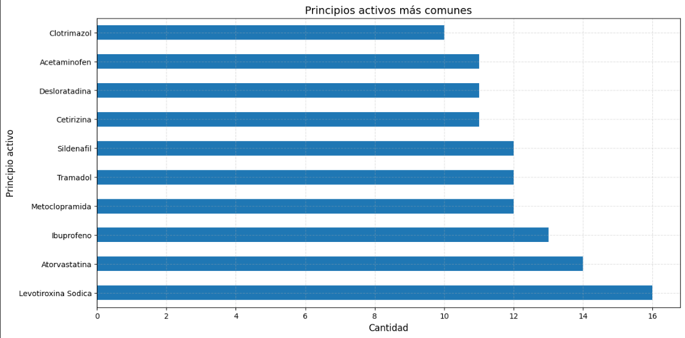
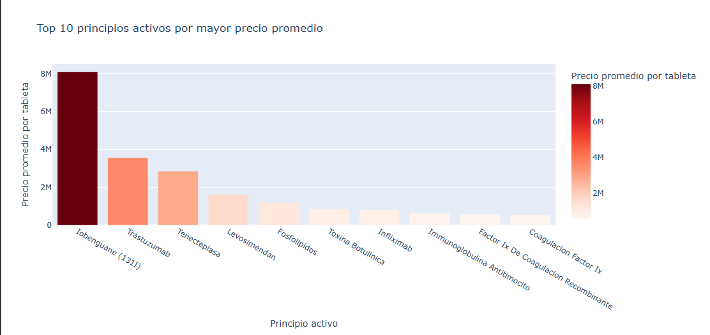
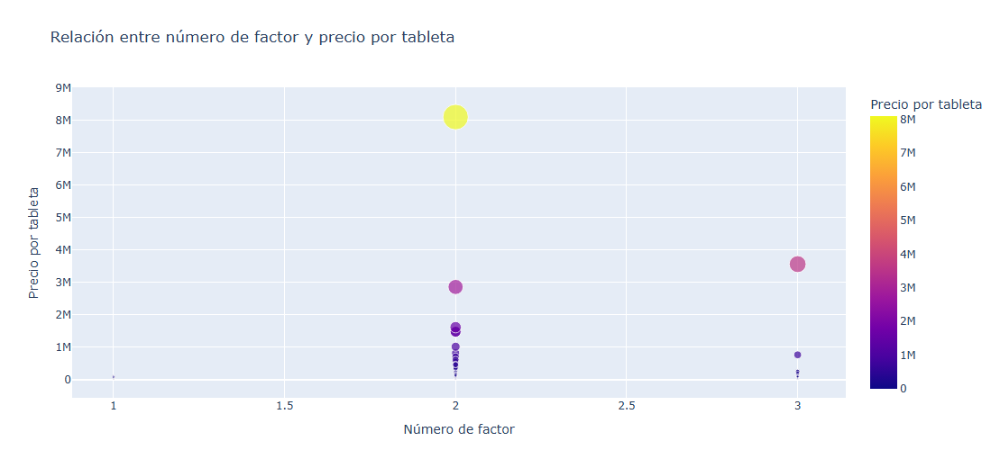
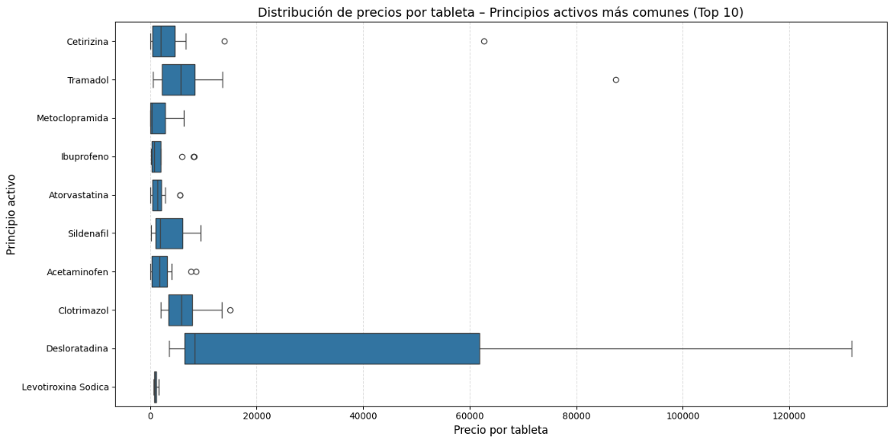

# Análisis de Datos de Medicamentos

El análisis de la base de datos y de las gráficas permite identificar patrones en la distribución de precios, 
frecuencia de uso y comportamiento del mercado farmacéutico. 
A continuación, se presenta un análisis consolidado que integra los hallazgos del informe inicial 
y la interpretación visual de las gráficas proporcionadas.

## Análisis General de la Base de Datos

El conjunto de datos revela una marcada variabilidad en precios según el fabricante, 
el principio activo y la forma farmacéutica. 
Se identifican fabricantes con precios promedio muy bajos, posiblemente asociados a medicamentos genéricos 
o estrategias de competencia, mientras que otros presentan precios elevados, vinculados a medicamentos 
de especialidad o con menor competencia.

En cuanto a los principios activos, los más frecuentes corresponden a medicamentos de alta demanda 
en el sistema de salud, pero no siempre los más caros. Algunos principios activos comunes mantienen precios 
estables y accesibles, mientras que otros, aunque populares, muestran rangos amplios y presencia de valores atípicos, 
lo que indica formulaciones especiales o versiones de marca con sobreprecio.

La distribución de precios evidencia que la mayoría de los medicamentos se concentra en rangos bajos, 
pero existen *outliers* que elevan el gasto promedio y podrían impactar significativamente el presupuesto 
del sistema de salud. Asimismo, el análisis por forma farmacéutica muestra que ciertas presentaciones tienden 
a ser más costosas, posiblemente por procesos de fabricación más complejos o liberación controlada.

En general, la base de datos refleja un mercado heterogéneo, con coexistencia de opciones económicas y de alto costo, 
donde las diferencias no dependen únicamente del tamaño de la presentación o número de unidades, sino de factores como 
patentes, origen del producto, tipo de formulación y nivel de competencia entre fabricantes.

## Análisis de Gráficas

### 1. Principios activos más comunes

- La **Levotiroxina Sódica** es el principio activo más frecuente, con 16 registros, lo que refleja su alta demanda en el sistema de salud.
- Otros como **Atorvastatina**, **Ibuprofeno** y **Metoclopramida** también destacan, incluyendo medicamentos para enfermedades crónicas y agudas.
- La mayoría de principios activos comunes tienen frecuencias relativamente cercanas, lo que sugiere un mercado equilibrado.

### 2. Top 10 fabricantes por precio promedio más bajo

- **Biosano**, **Medac** y **Sanderson** ofrecen precios muy bajos, posiblemente por producción genérica o políticas agresivas de precio.
- Existe un aumento progresivo en el precio promedio por fabricante hasta **Organon**, que es el más caro dentro del top de los más bajos.
- La diferencia de precios indica oportunidades de negociación para optimizar costos.

### 3. Top 10 principios activos por mayor precio promedio

- **Iobenguane (I131)** sobresale con un precio promedio por tableta superior a 8 millones, reflejando un medicamento de alta especialidad.
- Predominio de medicamentos **biotecnológicos y de especialidad** como Trastuzumab y Tenecteplasa.
- Existe una gran brecha entre los tres primeros y el resto, concentrando el mayor peso económico en pocos fármacos.

### 4. Relación entre número de factor y precio por tableta

- La mayoría de los medicamentos costosos se concentran en el **número de factor 2**, con alta variabilidad.
- El número de factor 3 presenta algunos precios elevados, pero no alcanza los máximos del factor 2.
- Se identifican *outliers* claros que representan casos muy específicos de alto costo.

### 5. Distribución de precios por tableta – Principios activos más comunes (Top 10)

- **Desloratadina** presenta la mayor dispersión de precios y *outliers* muy elevados, posiblemente por formulaciones de marca o presentaciones especiales.
- **Ibuprofeno** y **Levotiroxina Sódica** muestran rangos más estrechos, indicando un mercado más estable.
- Algunos principios activos como **Acetaminofén** y **Sildenafil** tienen valores atípicos que impactan el promedio.

